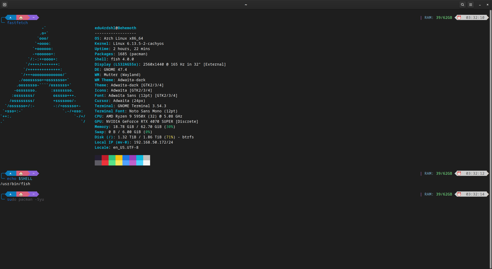

# Introduction

I've been using [Bash](https://www.gnu.org/software/bash/) for over 15 years. It's **THE BEST** shell out there. Not by technical merit, but by sheer inertia. It's the default shell on almost every system, every script is written for bash, a lot of systems simply symlink `sh` to `bash`, so it's what I've always used and what I've always recommended, it was a very good ride and can't blame bash for absolutely anything.

But things change, more modern alternatives appear, new useful features are added, features that will probably never be added to bash because of compatibility reasons. Time ago, I decided to give [Zsh](https://www.zsh.org/) a try, and honestly, it was a disaster. I'm almost sure that it was my fault, I didn't give it enough time, etc; but imo, the Zsh defaults are a mess, not intuitive at all, and therefore not good for someone too used to bash (who is a little nervous to leave the shell he's used for 15 years).

After some time investigating, and seeing that distros like ArchLinux uses [Fish](https://fishshell.com/) as the default shell on the live ISO, I decided to give it a try. And I'm loving it.

# Why Fish?

The first thing that I loved about [Fish](https://fishshell.com/), is how ready-to-use it's out of the box. The default configuration is perfect:

- Auto-suggestions just works.
- Syntax highlighting is there.
- Your bash history is automatically imported.
- A nice plugin system.
- A nice configuration system respecting the XDG Base Directory Specification.
- A nice help system.

# Migrating from Bash to Fish

Migrating from Bash to Fish is not hard, but it takes a bit of work if you have a bunch of bash-specific functions, aliases, etc. I had a lot of them, and I had to rewrite all of them. You can use some AI to help you with that (most IAs do a decent job for trivial tasks like it), if you don't want to do it manually. Here's a nice summary on the Fish documentation that will help you to understand the Fish syntax easier: [Fish for bash users](https://fishshell.com/docs/current/fish_for_bash_users.html)

I migrated all of my functions and all in about 2 hours, so it isn't that hard. The official documentation for [Fish](https://fishshell.com/) can be found [here](https://fishshell.com/docs/current/index.html).

## Installing requirements

We are going to install [Fish](https://fishshell.com/), [Fisher](https://github.com/jorgebucaran/fisher), and [oh-my-posh](https://ohmyposh.dev/). On ArchLinux, you can install the packages with:

```sh
sudo pacman -S fish fisher
```

Oh-My-Posh is available [on the AUR](https://aur.archlinux.org/packages?O=0&K=oh-my-posh), you can install it with your AUR helper.

```sh
paru -S oh-my-posh-bin
```

## Configuration

The Fish configuration is stored in `~/.config/fish/`. The main configuration file is `~/.config/fish/config.fish`. You can also have a `~/.config/fish/functions/` directory to store your functions, and a `~/.config/fish/completions/` directory to store your completions. There's also a `~/.config/fish/conf.d/` directory to store your drop-in configuration files which gets sourced when Fish starts.

### Main configuration file

Here's my `~/.config/fish/config.fish`:


```sh
# Disable the greeting, thanks fish
set fish_greeting ""

# Environment variables (Always set)
# Use neovim as the default editor
set -x EDITOR nvim
set -x VISUAL nvim
set -x DOTNET_CLI_TELEMETRY_OPTOUT 1

# Set PATH correctly (Appending user paths after system paths)
set -x PATH $PATH \
            $HOME/.local/bin

# Run only in interactive sessions
if status is-interactive
    # Initialize Oh My Posh
    oh-my-posh init fish --config /usr/share/oh-my-posh/themes/easy-term.omp.json | source
end
```


### Functions

Here's an example of a function that I use to join Podman containers (docker is also supported, in my case the docker command is an alias to podman):


```sh
function dexec
    set -l container ""
    set -l user "root"
    set -l shell "bash"

    # Parse options
    argparse c= u= s= -- $argv
    or return 1

    if set -q _flag_c
        set container $_flag_c
    end
    if set -q _flag_u
        set user $_flag_u
    end
    if set -q _flag_s
        set shell $_flag_s
    end

    # If no container was specified, list and let the user choose
    if test -z "$container"
        echo "No container specified. Listing running containers..."
        set -l containers (docker ps --format "{{.Names}}")

        if test -z "$containers"
            echo "No running containers found."
            return 1
        end

        echo "Select a container:"
        for i in (seq (count $containers))
            echo "$i) $containers[$i]"
        end

        read -P "Select a container: " container_index
        if test -n "$containers[$container_index]"
            echo "You selected: $containers[$container_index]"
            set container $containers[$container_index]
        else
            echo "Invalid selection."
            return 1
        end
    end

    echo "Executing '$shell' as user '$user' in container '$container'"
    docker exec -u "$user" -it "$container" "$shell"
end
```


### Aliases

Aliases use a slightly different syntax in Fish. Here's an example of a few aliases that I use:


```sh
# Use `eza` instead of `ls`
alias ls "eza"

# Upload Gists
alias gist "gh gist create"

# Some ls aliases
alias ll 'eza -l'
alias la 'eza -la'
alias l 'eza -hF'
```


So, just migrate your aliases and put the resulting file(s) in `~/.config/fish/conf.d/`.

### Completions

Fish automatically searches through any directories in the list variable `$fish_complete_path`, and any completions defined are automatically loaded when needed. Most software already have Fish completions, but if you need to create your own, see the [official documentation](https://fishshell.com/docs/current/completions.html).

### Plugins

Fish has a nice plugin system, you can use [Fisher](https://github.com/jorgebucaran/fisher) to manage your plugins. It's very easy to use, and you can install plugins with a single command. Here's a list of some plugins that I use:

- [z](https://github.com/jethrokuan/z): A "smart" cd command that learns your habits. TLRD: you have entered `~/Documents/Projects/Project1` several times, you can just type `z pro 1` and it will take you to `~/Documents/Projects/Project1`.
- [bass](https://github.com/edc/bass): A utility that makes it easy to use utilities written for bash in fish shell.

To install them, you can use the following commands:

```sh
fisher install jethrokuan/z
fisher install edc/bass
```

### Oh My Posh

As I was doing a shell migration after 15 years, why not change to a cool prompt too? I decided to give [Oh My Posh](https://ohmyposh.dev/) a try. It's a prompt theme engine for any shell: Bash, Zsh, Fish, _and even Powershell_. Well, it was designed for Powershell, initially. I'm using the [easy-term](https://ohmyposh.dev/docs/themes#easy-term) theme. See the [Main configuration file](#main-configuration-file) section to see how to initialize it.

### Changing the shell

To change the shell, you can use the following command:

```sh
chsh -s /usr/bin/fish $USER
```
After that, you need to log out and log in again.

# Results

This is how my terminal looks now:



I'm loving Fish, it's a great shell, and I'm happy with my decision to switch. I'm more productive, and I'm having fun with it.

# Conclusion

If you're a bash user, I recommend you to give Fish a try. It's a great shell, and you'll probably love it.

Happy fishing!
