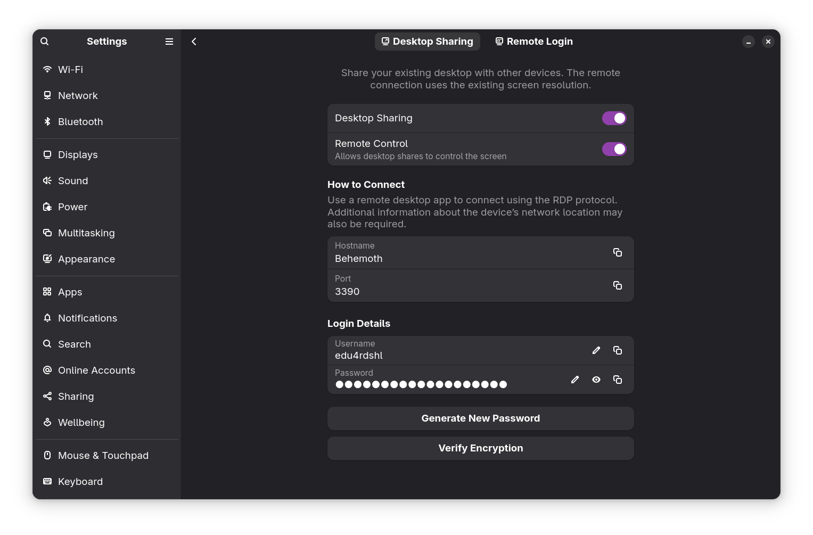
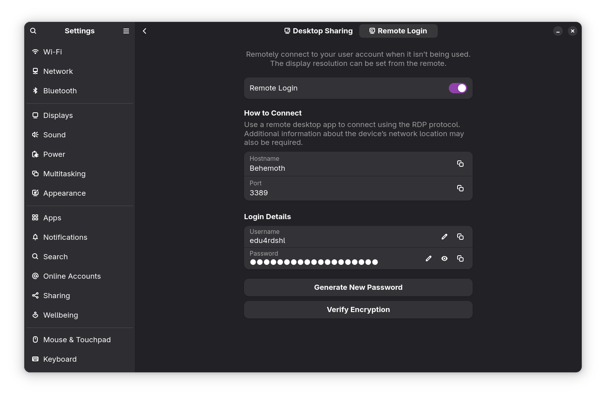
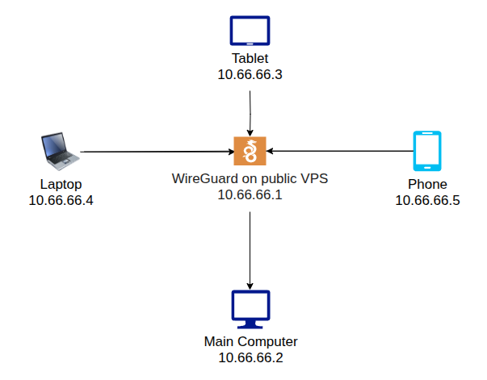
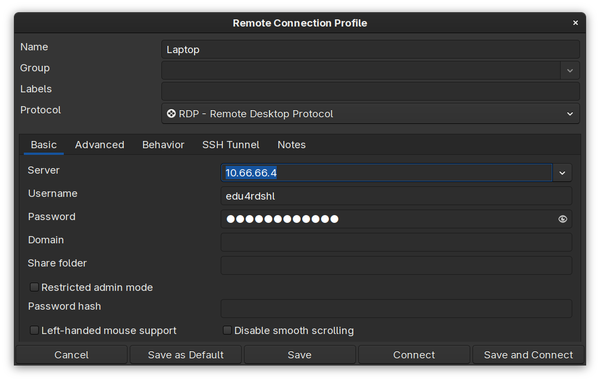
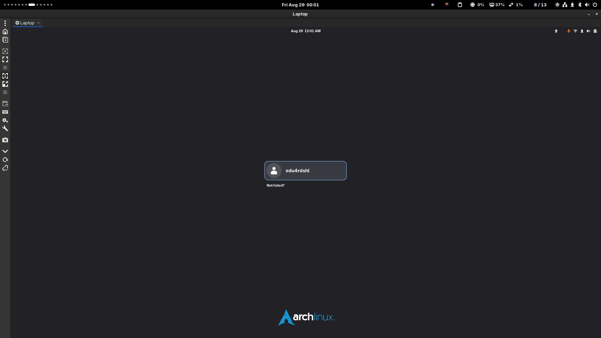
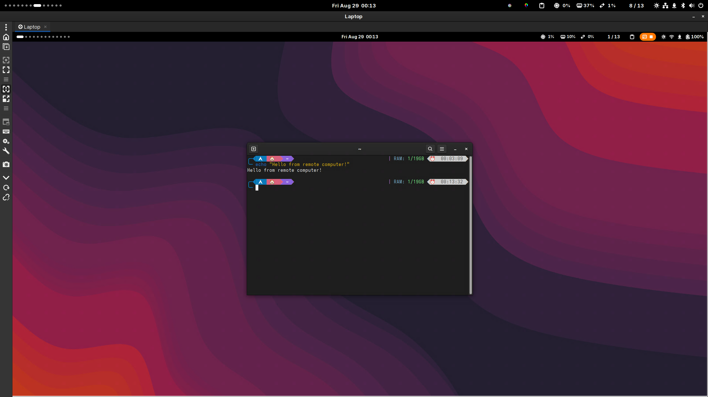

## Introduction

If you're on the Linux world, you may have heard of [Wayland](https://wayland.freedesktop.org/). For good or for bad. It's a modern display server protocol that aims to replace the aging X11 system. One of the key features of Wayland is its focus on security and simplicity, but it isn't free. There have been a lot of issues from simple daily usage, app-specific problems, but notoriously, remote **unattended** access has been a significant challenge. Let's focus on the **unattended** aspect.

## The problem

The main problem with **unattended** remote access is that Wayland does not allow applications to capture the screen or input events unless they are explicitly granted permission **each time**. This means that traditional remote desktop solutions like TeamViewer or AnyDesk, which rely on full-screen, and even full session access by default (for unattended access), do not work with Wayland, as of today, and I even doubt they ever will. The same applies to alternatives such as RustDesk, and on my experience, it's unreliable, slow, and harder to setup in case you want a self-hosted instance.

It's a significant limitation for users who need to access their systems remotely without physical presence, which is a common situation. I personally experience this when traveling, or even simply when I want to go to the office and need something from my main desktop (I work from home).

## The solution?

There is not a single, global solution for it, sorry. As everything on the Wayland world, it depends on the DE/WM implementation of it. In my case, I have been using Gnome [since 1 year ago](https://www.edu4rdshl.dev/posts/my-move-to-wayland-it-s-finally-ready/), which is one of the best DEs for Wayland support.

### Gnome Remote Desktop

Gnome offers [gnome-remote-desktop](https://gitlab.gnome.org/GNOME/gnome-remote-desktop), which tries to solve the problem. However, it isn't something that you can just enable and then connect from anywhere, but it's the key to achieving unattended access on Wayland in this post, for the following reasons:

#### Desktop Sharing

Gnome does offer the normal, RDP-like experience called "Desktop Sharing", allowing you to connect to **your current** Wayland session remotely, but don't allow you to unlock the computer. To enable it, go to Settings > System > Remote Desktop > Desktop Sharing > turn on "Screen Sharing". You will also need to configure the access credentials on that screen.



#### Remote Login

Additionally, Gnome supports a "Remote Login" feature, which enables you to log in to a Wayland session remotely without needing physical access to the machine. It works **on LAN**. To enable it, go to Settings > System > Remote Desktop > Remote Login > turn on "Remote Login". You will also need to configure the access credentials on that screen.

It's the feature that we are going to use to achieve unattended access.



### Wireguard

Wireguard is a modern VPN solution that is easy to set up and use. As any VPN, their main purpose is to help you to securely connect devices, without the need to expose them directly to the internet. The trick, is to have a public VPS, which you can find for a few dollars a month on providers like OVH Cloud, Hetzner or Vultr. I found a 4vCPU, 8GB RAM, and 72GB storage instance on OVH Cloud for $52/year.

I used [wireguard-install](https://github.com/angristan/wireguard-install) to setup my WireGuard server, so I'm not going into the details of the installation process here.

TLDR: run the script and follow the prompts. Once finished, if you want to add a new client, run the script again.

The setup looks like it:



### Important notes

- Configure your firewall on your VPS to allow incoming WireGuard traffic on the port configured in the WireGuard settings. It can be found in `/etc/wireguard/wgX.conf`, in the `ListenPort` field.
- Configure the firewall on the machine where you want remote access to accept connections on the "Remote Login" port (default is 3389).
- If you experience connection drops, enable `PersistentKeepalive` on the client's `[Peer]` configuration, setting it to `25` seconds.
- Make sure that the WireGuard clients are configured to allow incoming traffic from devices on the VPN. The client's configuration should be something like this (in case you used 10.66.66.x as the VPN subnet):


```
[Interface]
PrivateKey = <your_private_key>
Address = 10.66.66.2/32,fd66:66:66::2/128
DNS = 1.1.1.1,1.0.0.1

# Uncomment the next line to set a custom MTU
# This might impact performance, so use it only if you know what you are doing
# See https://github.com/nitred/nr-wg-mtu-finder to find your optimal MTU
# MTU = 1420

[Peer]
PublicKey = <your_peer_public_key>
PresharedKey = <your_preshared_key>
Endpoint = <your_vps_ip>:<your_vps_port>
PersistentKeepalive = 25
AllowedIPs = 10.66.66.0/24,fd66:66:66::/64 # You can be even more specific with allowed IPs if you want
```


### WireGuard client configuration

#### Linux

If you're using [NetworkManager on Linux](https://www.edu4rdshl.dev/posts/from-systemd-networkd-to-networkmanager/), it's as simple as:


```
$ nmcli connection import type wireguard file <path-to-your-client-config> # The client config needs a name that complies with the Linux interface naming conventions. e.g `wg0.conf`
```


It will automatically configure your VPN to start on boot. You can manually check with `nmcli connection show` and then check for the `connection.autoconnect` field.

**Tip:** you might want to set `ipv4.never-default` and `ipv6.never-default` to `yes` to prevent the VPN from being used as the default route and only use it for specific traffic on its network.

#### Android, Windows, and macOS

Android, Windows, and macOS clients can use the official WireGuard app to import the configuration file.

## Remote Access

**Note:** you need to keep your WireGuard VPN connection active on the device that you want to access remotely.

Now that we have our WireGuard VPN set up, we can use it to access our Gnome desktop remotely. Here's how to do it:

1. Connect to your WireGuard VPN from your client device.
2. Use an RDP client (like Remmina or Microsoft Remote Desktop) to connect to your Gnome desktop's IP address on the VPN (e.g., 10.66.66.2).
3. Log in using the credentials you set up in the "Remote Login" settings.

The setup on Remmina should look like this:



Now you're ready to connect to your Gnome desktop from anywhere! It does work really well.

- Login Screen



- Desktop Environment



Also, your session's state is saved, so you can easily reconnect later and continue where you left off.

## Additional notes

As long as the same principle is maintained, it is possible to achieve the same result in different ways. For example, you could use OpenVPN instead of WireGuard, or, in case that you don't have a remote VPS, you can use solutions like Cloudflare Tunnels, or Ngrok. DDNS may also be an option.

## Conclusion

It was a very cool experience setting up remote access to my Wayland session using WireGuard. The combination of a VPN and RDP worked seamlessly, and I can now access my desktop from anywhere with ease. I'd to say that WireGuard is one of the best pieces of software I've ever used lately.

Happy remote accessing!